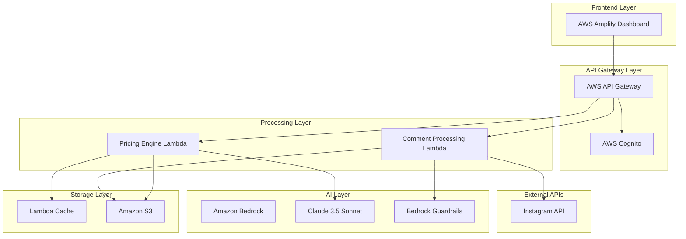

# Design Document: Inflomnia Phase 1 MVP

## Overview

Inflomnia is an AI-powered platform that helps digital creators focus on creativity by automating repetitive audience management and providing data-backed pricing guidance. The Phase 1 MVP leverages Amazon Bedrock's Claude 3.5 Sonnet for advanced reasoning, combined with AWS's serverless architecture to deliver two core demo-ready features within a 12-day development sprint.

The Phase 1 MVP focuses on two essential capabilities:
- **Comment Shield**: Automated spam/toxic content filtering with high-value engagement surfacing
- **Brand Pricing Intelligence**: Data-backed pricing recommendations for creator partnerships

## Architecture

### High-Level Architecture



### Component Architecture

The system follows a simplified serverless architecture optimized for rapid prototyping:

1. **Frontend Layer**: AWS Amplify hosted dashboard with responsive design
2. **API Layer**: AWS API Gateway with basic authentication
3. **Processing Layer**: AWS Lambda functions for core business logic
4. **AI Layer**: Amazon Bedrock with Claude 3.5 Sonnet and Guardrails
5. **Storage Layer**: S3 for data persistence and Lambda caching for performance

## Components and Interfaces

### 1. Comment Shield Service

**Purpose**: Automatically filters spam and toxic comments while surfacing high-value engagement.

**Core Components**:
- `ContentClassifier`: Uses Amazon Bedrock Guardrails to identify spam/toxic content
- `EngagementScorer`: Evaluates comment engagement value
- `FeedbackProcessor`: Learns from creator approval/rejection decisions
- `DashboardUpdater`: Updates AWS Amplify dashboard with filtering results

**Key Interfaces**:
```typescript
interface CommentFilterResult {
  isFiltered: boolean;
  category: 'spam' | 'toxic' | 'high-value' | 'normal';
  confidence: number;
  engagementScore: number;
}

interface FilteringSummary {
  totalProcessed: number;
  spamFiltered: number;
  highValueSurfaced: number;
  timestamp: Date;
}
```

**Data Flow**:
1. Receive comments from Instagram API
2. Apply Amazon Bedrock Guardrails for content classification
3. Score engagement value based on content analysis
4. Update dashboard with filtering summary
5. Store creator feedback to refine filtering rules and confidence thresholds

### 2. Brand Pricing Intelligence Service

**Purpose**: Provides data-backed pricing recommendations for creator partnerships.

**Core Components**:
- `CreatorProfileAnalyzer`: Analyzes follower count, niche, and engagement
- `PricingCalculator`: Uses Claude 3.5 Sonnet for nuanced pricing recommendations
- `MarketComparator`: Compares against similar creator benchmarks
- `CacheManager`: AWS Lambda caching for fast dashboard retrieval

**Key Interfaces**:
```typescript
interface PricingRequest {
  niche: string;
  followerCount: number;
  platform: 'instagram' | 'youtube' | 'tiktok';
  engagementRate?: number;
}

interface PricingRecommendation {
  suggestedRange: {
    minimum: number;
    recommended: number;
    maximum: number;
    currency: string;
  };
  reasoning: string;
  comparableCreators: number;
  confidence: number;
}
```

**Processing Pipeline**:
1. Receive creator profile inputs (niche, followers)
2. Query Claude 3.5 Sonnet for pricing analysis
3. Generate reasoning based on market comparisons
4. Cache results in Lambda for fast retrieval
5. Display recommendations in dashboard

## Data Models

### Creator Profile (Simplified)
```typescript
interface CreatorProfile {
  id: string;
  name: string;
  platform: 'instagram' | 'youtube' | 'tiktok';
  username: string;
  followerCount: number;
  niche: string;
  engagementRate?: number;
  createdAt: Date;
}
```

### Comment Data
```typescript
interface Comment {
  id: string;
  creatorId: string;
  platform: string;
  content: string;
  author: string;
  timestamp: Date;
  filterResult?: CommentFilterResult;
  creatorFeedback?: 'approved' | 'rejected';
}
```

### Pricing Data
```typescript
interface PricingHistory {
  id: string;
  creatorId: string;
  request: PricingRequest;
  recommendation: PricingRecommendation;
  timestamp: Date;
}
```

## Correctness Properties

Based on the acceptance criteria analysis, the following correctness properties must be upheld by the Inflomnia system:

### Property 1: Comment Classification Consistency
**Validates: Requirements 1.2**

For any given comment content, Amazon Bedrock Guardrails must consistently classify spam/toxic content with the same result across multiple invocations.

```typescript
property("Comment classification is consistent within session", () => {
  forAll(commentContent: string, (content) => {
    const result1 = bedrockGuardrails.classify(content);
    const result2 = bedrockGuardrails.classify(content);
    return result1.category === result2.category && 
           result1.confidence === result2.confidence;
  });
});
```

### Property 2: Feedback Processing Integrity
**Validates: Requirements 1.4**

The system must always store creator feedback and maintain data integrity when processing approval/rejection decisions.

```typescript
property("Feedback is always stored and processed", () => {
  forAll(feedback: CreatorFeedback, (fb) => {
    const stored = feedbackProcessor.store(fb);
    const retrieved = feedbackProcessor.retrieve(fb.commentId);
    return stored.success && 
           retrieved.creatorFeedback === fb.decision &&
           retrieved.timestamp <= Date.now();
  });
});
```

### Property 3: Pricing Reasoning Completeness
**Validates: Requirements 2.2**

Claude 3.5 Sonnet must always provide reasoning for pricing recommendations, and the reasoning must be non-empty and contextually relevant.

```typescript
property("Pricing recommendations always include reasoning", () => {
  forAll(pricingRequest: PricingRequest, (request) => {
    const recommendation = claudeEngine.generatePricing(request);
    return recommendation.reasoning.length > 0 &&
           recommendation.reasoning.includes(request.niche) &&
           recommendation.suggestedRange.minimum > 0;
  });
});
```

### Property 4: Cache Performance Consistency
**Validates: Requirements 2.3**

Lambda caching must provide faster response times for repeated requests compared to initial requests.

```typescript
property("Cached requests are faster than initial requests", () => {
  forAll(pricingRequest: PricingRequest, (request) => {
    const startTime1 = Date.now();
    const result1 = pricingService.getPricing(request);
    const duration1 = Date.now() - startTime1;
    
    const startTime2 = Date.now();
    const result2 = pricingService.getPricing(request);
    const duration2 = Date.now() - startTime2;
    
    return duration2 < duration1 && 
           result1.suggestedRange.recommended === result2.suggestedRange.recommended;
  });
});
```

### Property 5: Dashboard Summary Accuracy
**Validates: Requirements 1.3**

The dashboard summary must accurately reflect the actual filtering results with correct counts.

```typescript
property("Dashboard summary matches filtering results", () => {
  forAll(comments: Comment[], (commentList) => {
    const filterResults = commentList.map(c => commentShield.filter(c));
    const summary = dashboardUpdater.generateSummary(filterResults);
    
    const expectedSpam = filterResults.filter(r => r.category === 'spam').length;
    const expectedHighValue = filterResults.filter(r => r.category === 'high-value').length;
    
    return summary.spamFiltered === expectedSpam &&
           summary.highValueSurfaced === expectedHighValue &&
           summary.totalProcessed === commentList.length;
  });
});
```

## Testing Framework

The system uses **fast-check** for property-based testing in TypeScript/JavaScript environment:

```typescript
import fc from 'fast-check';

// Example test generator for comments
const commentArbitrary = fc.record({
  id: fc.uuid(),
  content: fc.string({ minLength: 1, maxLength: 500 }),
  author: fc.string({ minLength: 1, maxLength: 50 }),
  timestamp: fc.date()
});

// Example test generator for pricing requests
const pricingRequestArbitrary = fc.record({
  niche: fc.constantFrom('food', 'tech', 'fashion', 'travel', 'fitness'),
  followerCount: fc.integer({ min: 1000, max: 1000000 }),
  platform: fc.constantFrom('instagram', 'youtube', 'tiktok'),
  engagementRate: fc.option(fc.float({ min: 0.01, max: 0.15 }))
});
```

## Performance Optimization

### Lambda Caching Strategy
- **In-Memory Cache**: Store pricing calculations for 15 minutes
- **Cache Key**: Hash of niche + follower count + platform
- **Cache Hit Ratio Target**: >80% for repeated requests
- **Memory Allocation**: 512MB Lambda with 100MB reserved for cache

### Bedrock Guardrails Optimization
- **Batch Processing**: Process up to 10 comments per API call
- **Confidence Threshold**: 0.8 for spam classification
- **Fallback Strategy**: Manual review queue for low-confidence results
- **Rate Limiting**: 100 requests per minute per creator